## So you want a personal website

In this day and age one might argue that _not_ having a website or a social media account means

> you do not exist 😱

## How can we solve this?

Let's try using the [K.I.S.S.](https://en.wikipedia.org/wiki/KISS_principle) principle => "Keep it simple, stupid"

We need to ask ourselves:

1. What do we want?
2. Where are we going to put it?

Let's assume we need to create a personal website with some simple static files - GREAT 🏆

How and where are we going to host it?

> In a personal Microsoft Azure Subscription

Where are we going to keep our static content for our website and what happens if we need to change it?

> Azure DevOps => in a git repository

## 0. Prerequisites

You need to have GIT installed on your local machine.

See install options for your machine [here](https://git-scm.com/downloads)

## 1. Steps for content creation

1. Create a local folder `MyProject`
2. Use your favourite code editor to create the static HTML pages for your website.
3. Head over to [Azure DevOps](https://dev.azure.com) and create a free account => it can host all your projects and you can manage almost everything in there
4. Setup your "organization" aka your DevOps username => e.g. https://dev.azure.com/florinbobis

5. Create a new private project in DevOps

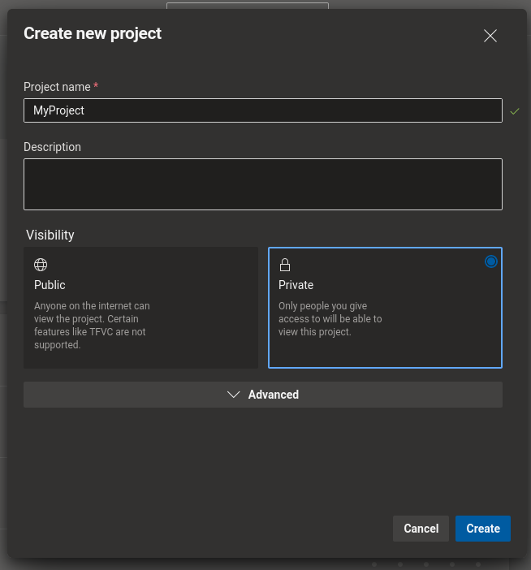

6. Go to the newly created project's git repository

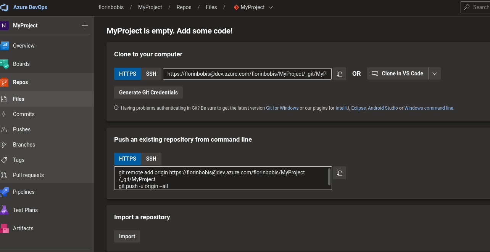

7. From your local editor using command line push your repo

   - 7.1 Initialize, add the files and commit them

```bash
git init
git add .
git commit -m "Initial commit"
```

   - 7.2 Push the changes to your newly created git repo

```bash
git remote add origin https://florinbobis@dev.azure.com/florinbobis/MyProject/_git/MyProject
git push -u origin --all
```

## 2. Steps for resource provisioning

1. Now let's head over to Azure
2. Create an Azure account if you don't already have one. Don't worry it's free and you also get a 200$ credit for the first 12 months or so. Start [here](https://azure.microsoft.com/en-us/free/)
3. After you are logged into https://portal.azure.com you will be greeted with this

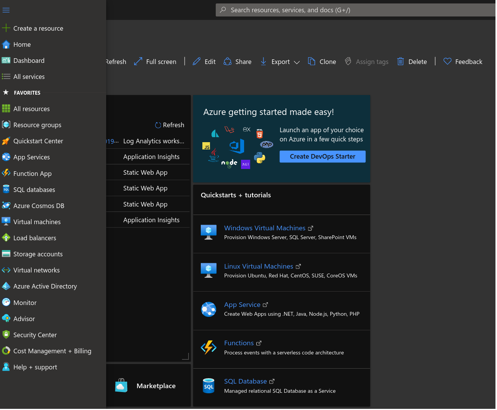

4. Time to be brave. Click on create resource and search for **Static Web App**

   - 4.1 Fill in the name of the website and the resource group name
   - 4.2 Make sure to select **Free** for the plan type 💸
   - 4.3 For the deployment details we will select "Other" for now - (I'll explain in a bit)
   - 4.4 Click on Create

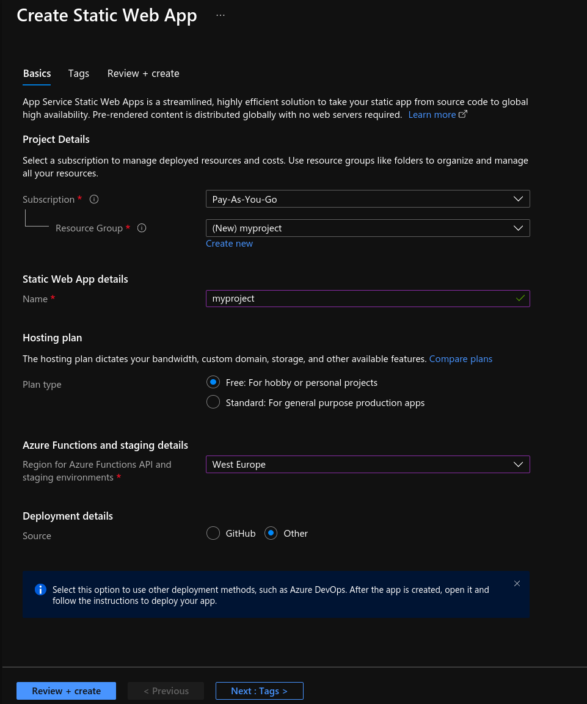

5. Now that our resource is created we are greeted with this

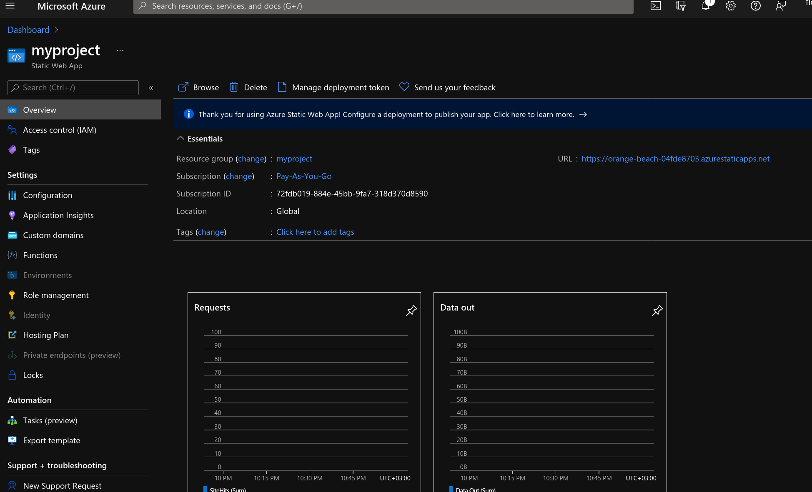

6. You can now click on the URL and see what happens 😉 That's right

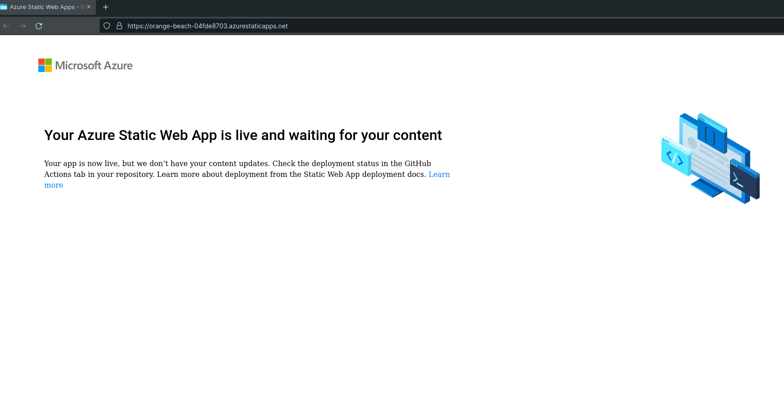

## 3. How do we publish our website?

Now let's glue the pieces together, shall we?
We have the content, but how are we going to publish and deploy our website to Azure? 🤔

We need to deploy our existing content from the git repository in Azure DevOps to the Azure Static Web App.

How can we automate this such that it won't become a pain to deploy?

That is quite easy. Let's follow the steps:

1. Head back over to your codebase and add a new file named `azure-pipelines.yml`.
   This will handle automation of deployments for your website when we push changes to our master branch.

2. Paste the following content (this might depend on your configuration. It can vary depending on the technology you are using: React, Angular, Static site generators, etc.)

   ```yaml
   trigger:
     - master

   pool:
     vmImage: "ubuntu-latest"

   steps:
     - checkout: self
       submodules: true
     - task: AzureStaticWebApp@0
       inputs:
         app_location: "/"
         output_location: "public"
         api_location: "api"
         azure_static_web_apps_api_token: $(deployment_token)
   ```

3. Push changes to the git repository

   ```bash
   git add .
   git commit -m "Added pipeline"
   git push origin master
   ```

4. Now let's head over to DevOps and create a new pipeline. Click on the Pipelines section in the Pipelines menu and then on Azure Repos

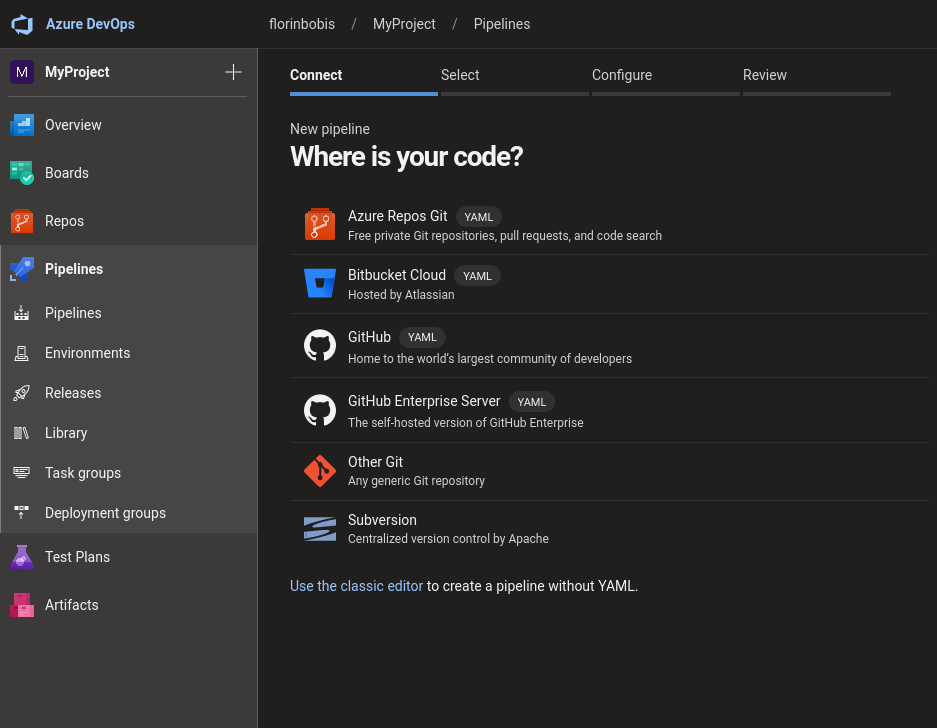

5. Select the repo from the list and then choose _Existing Azure Pipelines_

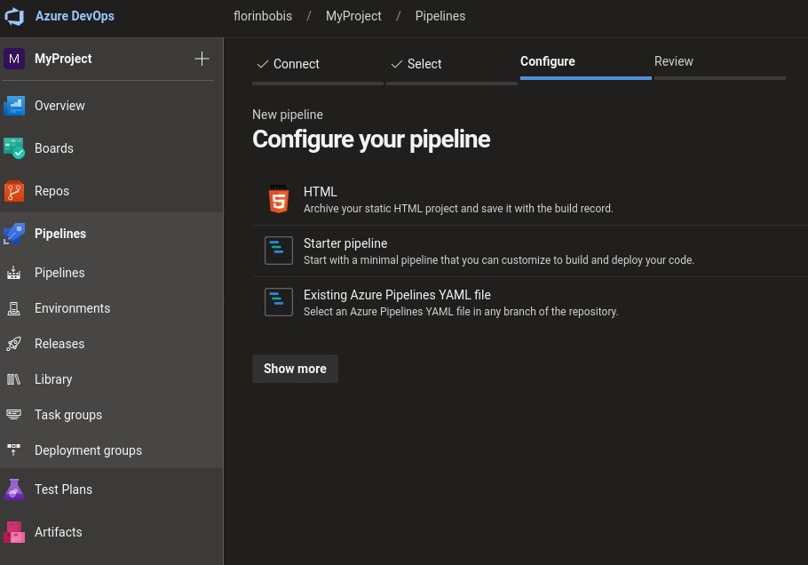

6. Review pipeline and click on Variables
7. As you saw in the yml file we need a "deployment_token", so let's add that in the Name field
8. For the value we need to head over to the Azure Static Web App resource and click on **Manage deployment token**

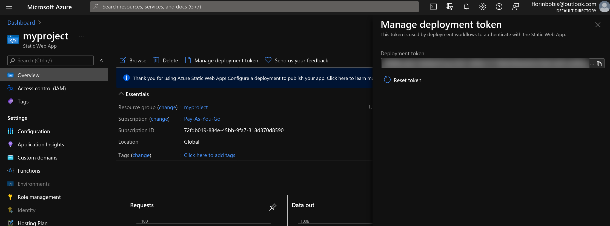

9. Now copy the value and paste it in Azure DevOps
10. Make sure to set the value as secret for security purposes

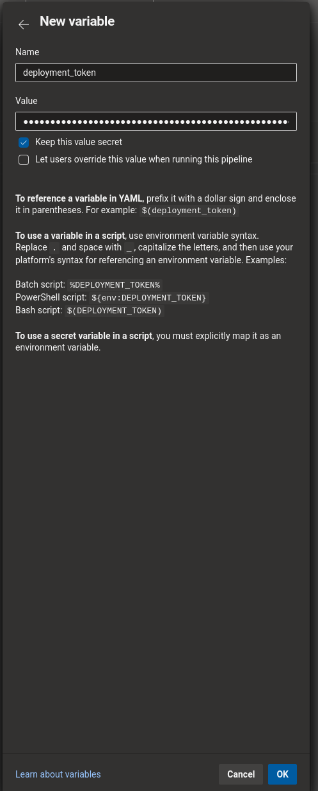

11. Click Ok, Save and then click Run
12. If all goes well 🤞 you should see something similar to this

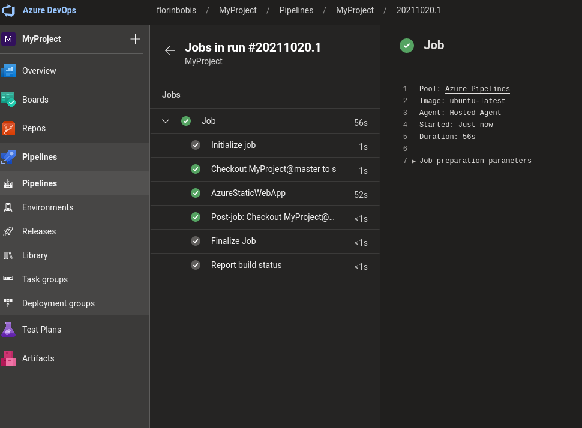

Hurray! 👑

You can now head over to the URL provided by the Azure Static Web App and see it.

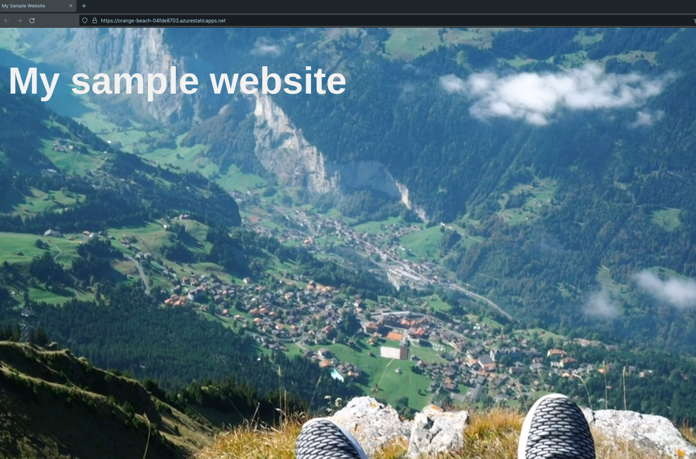

> There you go!
> You have now successfully created your free, personal website with automated deployment.
> Now's the perfect time to pat yourself on the back and pour yourself a cup of ☕

## Further reading

You can find more tutorials on different ways of doing this on Microsoft's Docs [page](https://docs.microsoft.com/en-us/azure/static-web-apps/getting-started?tabs=vanilla-javascript)

> [!warning] Warning 
>
> Certain sections may be subject to changes on Azure