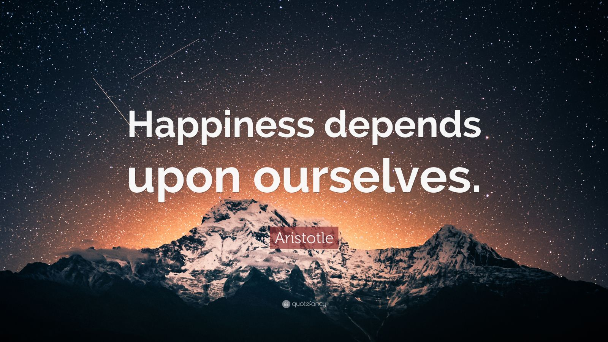
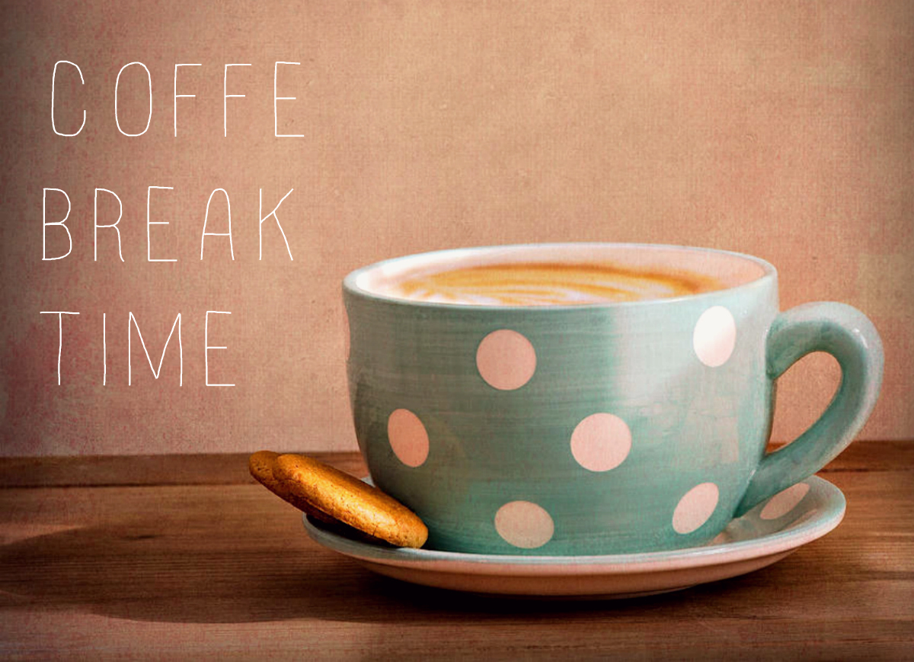
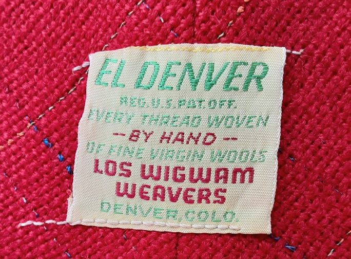
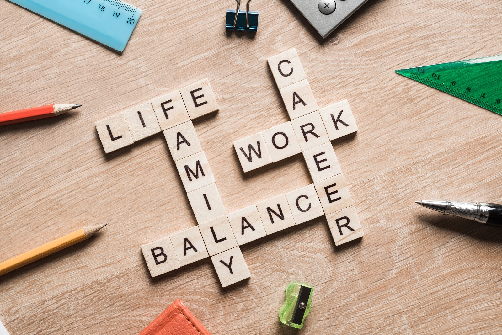

import { Tweet, Vimeo, YouTube } from "astro-embed";

**_...while also letting everyone breath_** 😌

> The message of this article is mostly directed towards companies, but more specifically to the ones in the IT industry

## Context

The IT industry has been struggling for years to optimize and shorten their internal processes. Companies have gone through extreme lengths in order to make sure that everything is kept under control with a firm grasp.

Is this something that improves people's lives, or just makes the companies feel better about themselves?

Let's dig deeper...

> 💡 We can only improve other people's lives when we start to improve ours.

At the core of our being we, humans, **need** to have a _purpose_, a goal, something that makes us happy and fulfilled. So what makes us happy and fulfilled?

- Helping others?
- Creating something of value?
- Reducing the amount of pain and suffering in this world?

All of the above are valid precursors of happiness.

## Solution

In order to achieve this, we need to be able to balance structure and chaos.
Too much of one or the other can lead to a lot of stress and frustration.

Structure is needed to provide a firm solid ground for achieving our goals. The element of chaos is also needed in order to get us out of our comfort zone and explore new horizons and ideas.

### How can we achieve this?

First of all, companies would need to create simple, intuitive processes that are straightforward and welcomed by the employees.

We use structure not to make people's lives miserable, but make them better.

**Structure** is not there to make us go through painstakingly long work hours, but to help us achieve more in less time, to help us get back home to our beloved ones much faster.

We, as human beings, need more _life_ in our work and less ~~work~~ in our lives.

This can only be achieved if we understand that in a modern civilization the 8h work day is obsolete.

Most of the planet's industry is not driven by factory workers anymore. We are no longer welding machine parts in a factory. The industrial age is long gone. Robots are starting to take over these repetitive tasks and are able to do it 24/7. They are becoming more intelligent and self-sufficient each day, they are now able to make their own decisions.

So ask yourself this

> ❓ Why are we using the same frame of mind (_the industrial age mentality_) when we talk about the work hours? 🤔

Corporations still feel the need to control every aspect of their employees lives, and its understandable up to a point.

But there is no need for that. Responsible, adult and hardworking people do not require anyone checking how many hours they worked in a given week.

Society should focus more on achievements based on **creativity** and not put the work hours under such a scrutiny.

The value of a product is not based on 4 hours of work or 2 months of work. It is based on the **_results_** that help the client move forward with their goals in life, and have more quality time with his/her family and friends.

> The work day of 8 hours is a primitive concept in this day and age.

A much more modern way for the creative/IT industry would be to have a 6 hour work day. That would include the commute as well as the lunch.

Such change would instantly boost the employee happiness and also make them more dedicated to their work. It is a psychological mind game that enables the mind to disregard the whole concept of hours, and instead focus on the creativity and productivity.

### Example

John Smith would go to work at 8AM. Arrive there at 8:30. Work til noon. Have a half hour lunch. Get back to work until 13:30 and then head back home to his loving family. He would have leisure time in the afternoon for walks in the park, fitness and more. More time with the family equals more overall mind relaxation as well as overall better efectiveness.

The leisure/break time approach was first implemented during the industrial revolution.

## History time

**The Coffee Break** - you might be wondering.. where did that come from?

### The Coffee Break

There was a necktie manufacturer in Denver called **Los Wigwam Weavers**. They made these very intricate silk neckties. During WW2 they lost all their best loom operators to the war effort.

Then they hired women to do it, because they could do these very intricate patterns, very complicated looms. The problem was that they could do it really well only for about 4-5 hours. So they called a meeting and the owners said to the workers:

> What could we do? We have to improve your efficiency, we need more output.

And the women said:

> Well, give us some time at 10 in the morning & 4 in the afternoon and give us some coffee and tea.

The company started doing it and low and behold, overnight, their productivity and efficiency goes up, so they instituted <mark>The Coffee Break</mark>. 🤩

Your employer basically gives you a drug and then gives you time off in which to ingest it.
The coffee break might seem like it's something your boss is giving you, but it's a way to extract more value from you. 🤔

In the end, it's not about  a life/work balance is needed in order to achieve results at work.
Yes, **Life/Work**🥰 balance... NOT ~~work/life~~😔 balance.

### Life is primary, work is secondary!

---

<YouTube id="https://youtu.be/HSpdA_p3Bak" />
