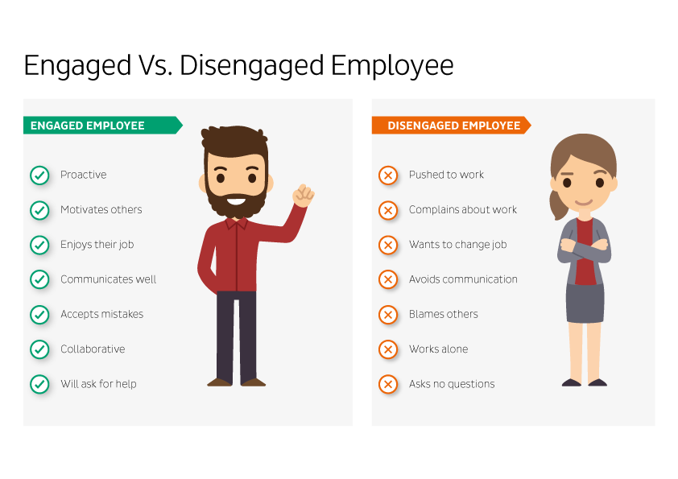
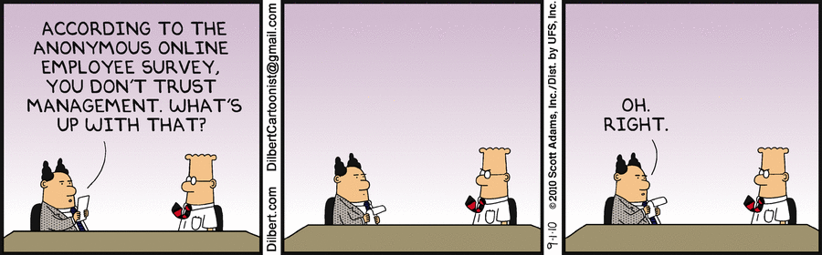

We need to get back to professional common sense and the cordial relationship that developed over the course of the last century between employers and employees.

There is an intrinsic subordination relationship between the _employer_ and the _employee_. There is also an intrinsic equality of treatment and courtesy between profesionals in an industry.

Thus, we should not praise the valiance of an employee vilifying his/her employer, nor should we praise an employer that is squashing any free thinking (fringe) employees.

There is a balance that needs to be upheld. Employees need to understand that they are valued as profesionals in a company, given profesional courtesy and respect, as long as they don't cross certain boundaries:

- getting into political agendas or
- trying to monetize social gains over quarels with their employer

When that line is crossed, all bets are off, no right or wrong can protect them from getting fired.  
Each company upholds their own principles and enforces their own policies..but that does _not_ mean being immoral, ruthless or using your human resources as cattle.

On the other hand, the employee needs to understand the subordination to the higher ranks of the ierarchy, otherwise chaos insues.

> There is a time to argue, and there is a time to listen.
> There is a place to argue and there is a place to listen.

No matter how smart, passionate or frustrated a person can be, they should **NEVER** try to launder their emotional problems in public - it makes them look weak, vengeful and pitiful.

Never have I, in my career, known someone to complain about their boss or contradict their boss in social media (or public space) - that would be career suicide 🤯

If you do not understand that.. it just proves my point.

We are neither angels, nor demons, but authority needs to be respected, otherwise we are just a bunch of anarchic children like those in William Golding's "Lord of the Flies".

If you ever disagree with your boss you can make a respectful statement as to **why** and how **he** "_might_" be incorrect, and also provide a valuable solution.

If you just troll your boss without providing a solution, and also have been in the company for more than 5 years - plenty of time to come with strategies and solutions - that doesn't bode too well on your behalf, does it? That makes you just another vengeful, frustrated person.. who does not know how to handle a situation as an adult.

People are wrong a lot of times, on a lot of matters. That does not mean that if you are right, you have the moral high ground. Conducting social media vendettas to raise your personal ego and internet popularity is at most infantile.
This attitude is harmful and it's not how a professional should behave.

In conclusion, I advise you to compose yourself and think before uttering hateful words.
Here's a checklist ⬇️

- [x] Is it helpful to the other person?
- [x] Does it contribute to my wellbeing?
- [x] How do I sound like?

A moment of thought, a pause before you speak, a bit of selfawareness and sentence _rephrasing_ can go a long long way.

> An employee's loyalty is earned, not demanded.

That quote has a lot of meaning and provides insight into the kind of symbiotic relationship an employer and employee should have.

PS: Dilbert is still trying.

🚀 TO BE CONTINUED...
