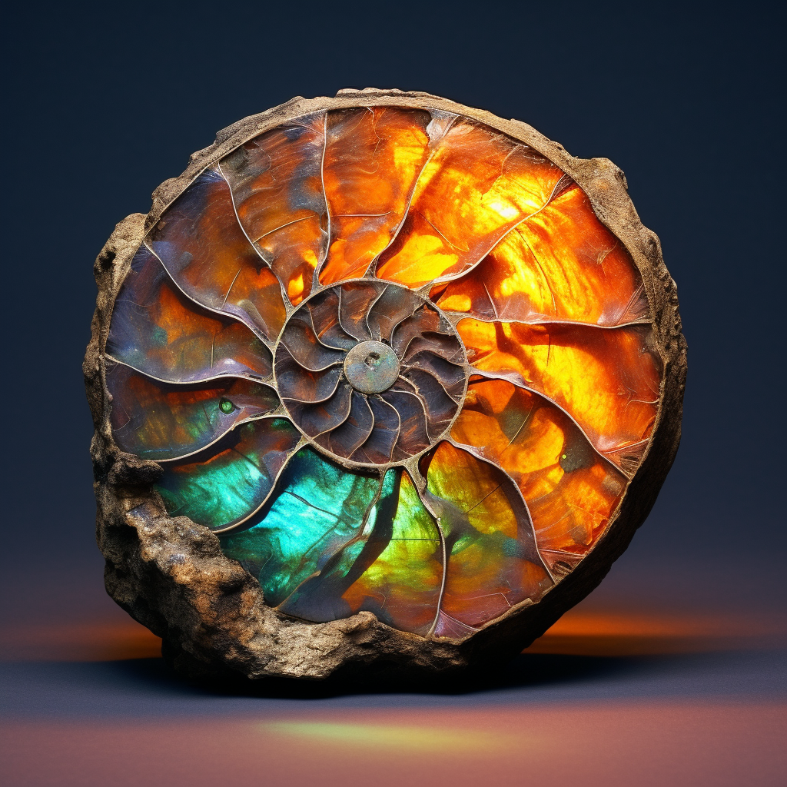
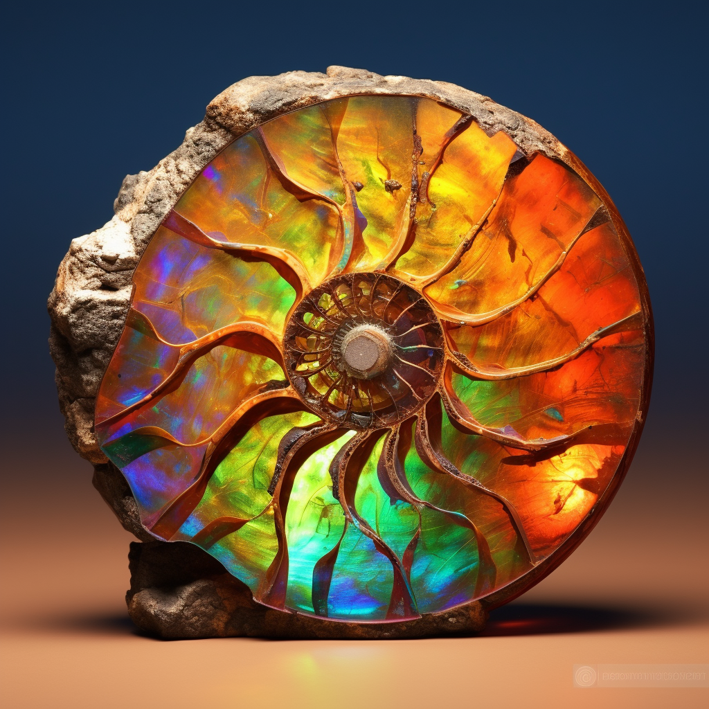
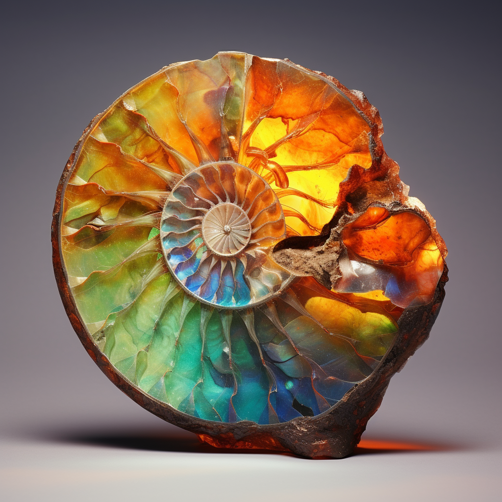
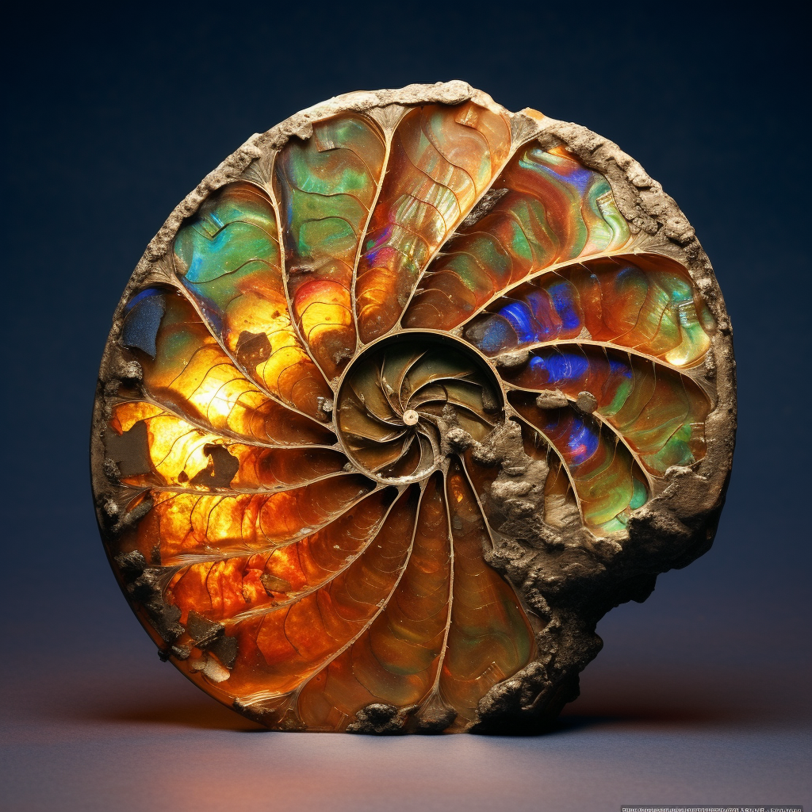

## Table of contents

## Overview

Ammolite is the fossilized shell of ammonites, which are composed primarily of aragonite or calcite.

Ammolite is typically used to create doublets or triplets that are suitable for making durable jewelry.

Ammolite is famous for its remarkably vivid play of colour, caused by lamellar structure of the glass-like shell. It is also called gem ammonite, calcentine, and korite.

More info can be found here 👉[^1]

[^1]: https://www.gemdat.org/gem-8393.html

## Colour

Iridescent colors of red, purple, blue, green, yellow

## Hardness

3½

## Specific Gravity

2.76 - 2.84

## Images

