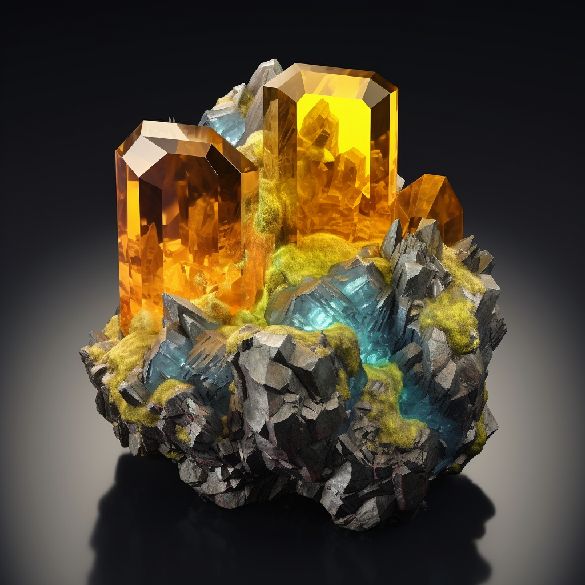
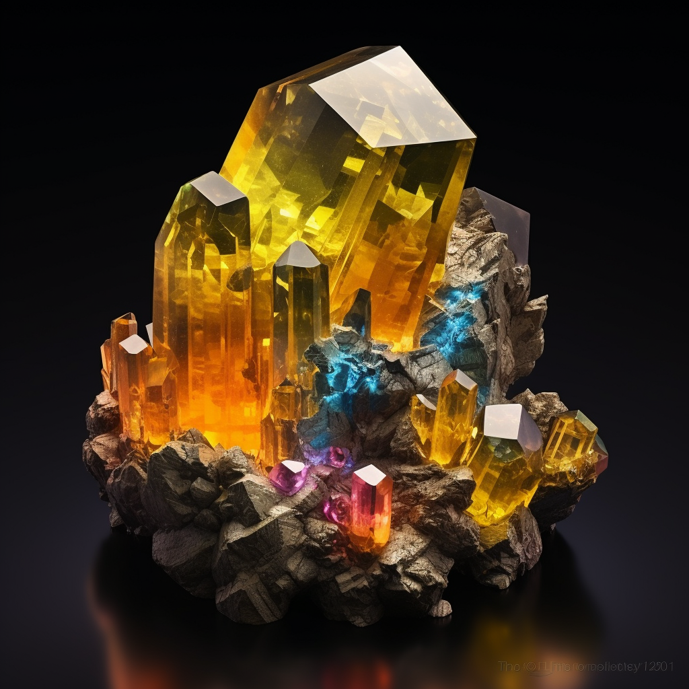
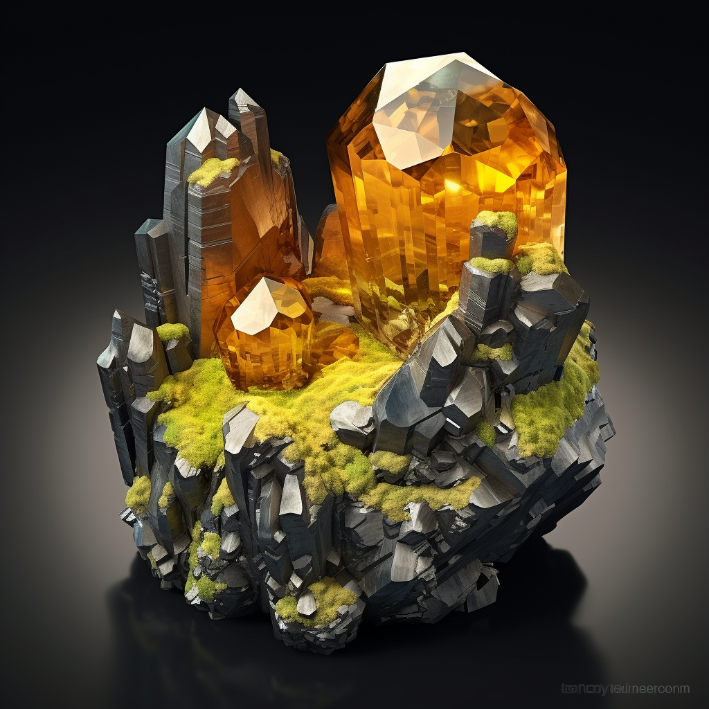

## Table of contents

## Overview

Named in 1832 by Francois Sulpice Beudant for the type locality, the Parys Mine on the Island of Anglesey (Ynys Môn) in Wales, U.K.

Anglesite forms transparent colourless crystals, often with yellow, green or blue shades. Anglesite is cut into attractive faceted stones, but it is brittle and sensitive to heat.

Fine crystals are found at various places in the USA, in the Leadhills district, Scotland and the best cuttable material comes from the Touissit mine, Oujda, Morocco.

More info can be found here 👉[^1]

[^1]: https://www.gemdat.org/gem-233.html

## Formula

PbSO4

## Colour

Colorless to white, often tinted grey, yellow, green or blue; colourless in transmitted light.

## Crystal System

Orthorhombic

## Group

Baryte

## Lustre

Adamantine, Vitreous, Resinous

## Hardness

2½ - 3

## Specific Gravity

6.37 - 6.39

## Images

