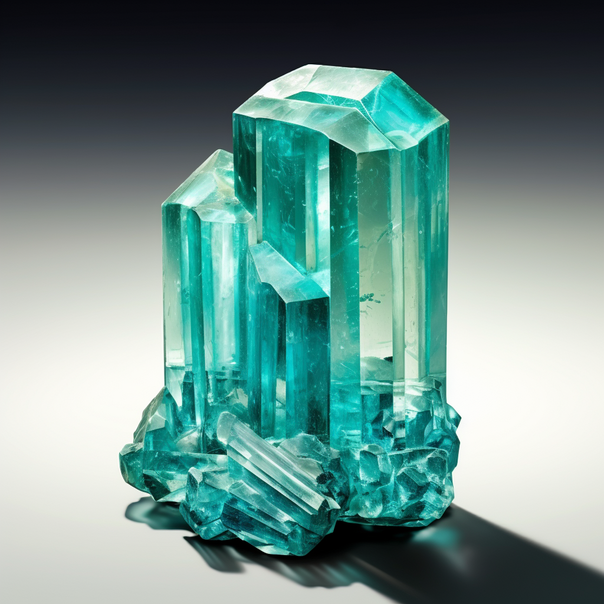
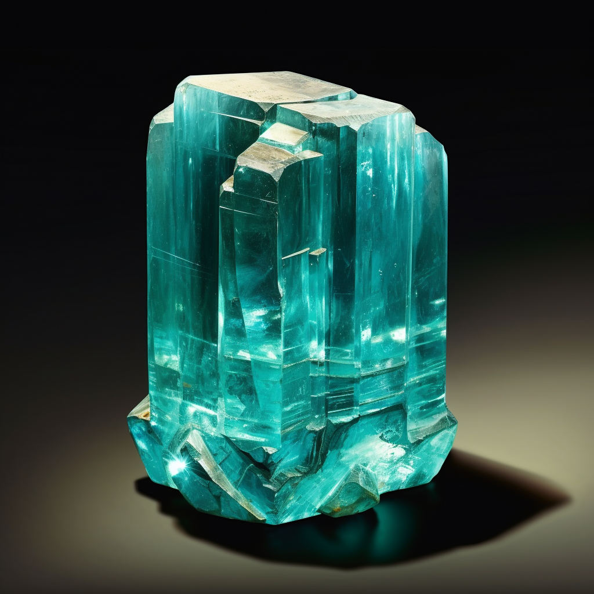
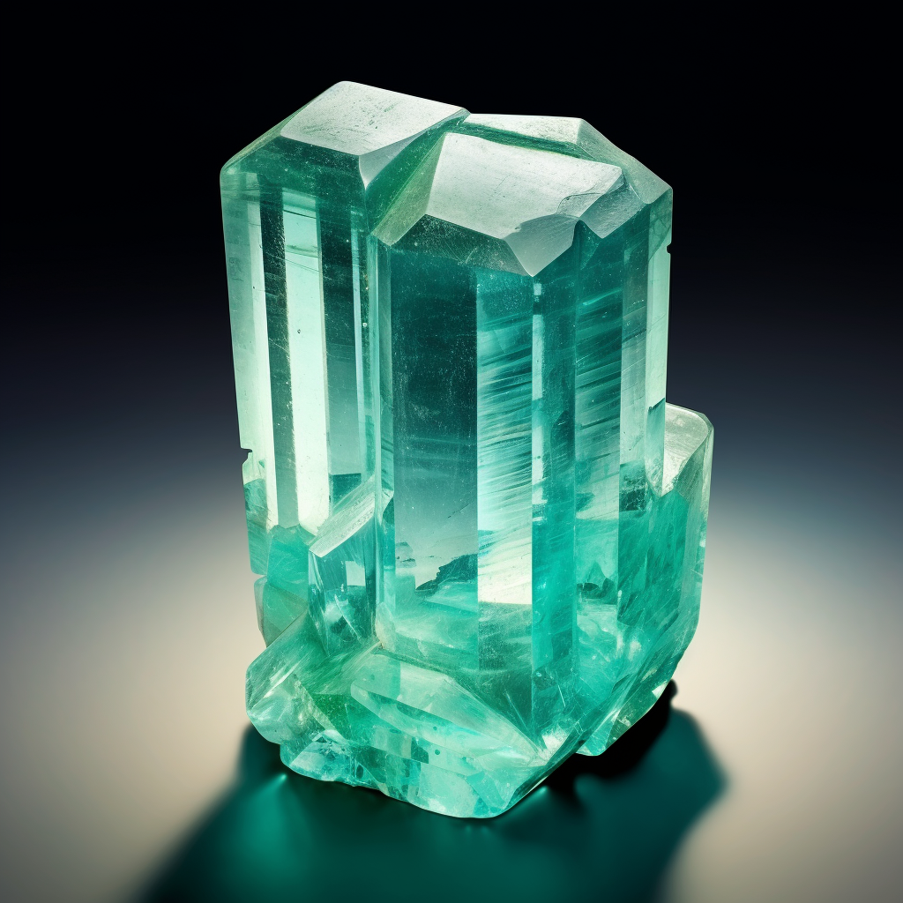
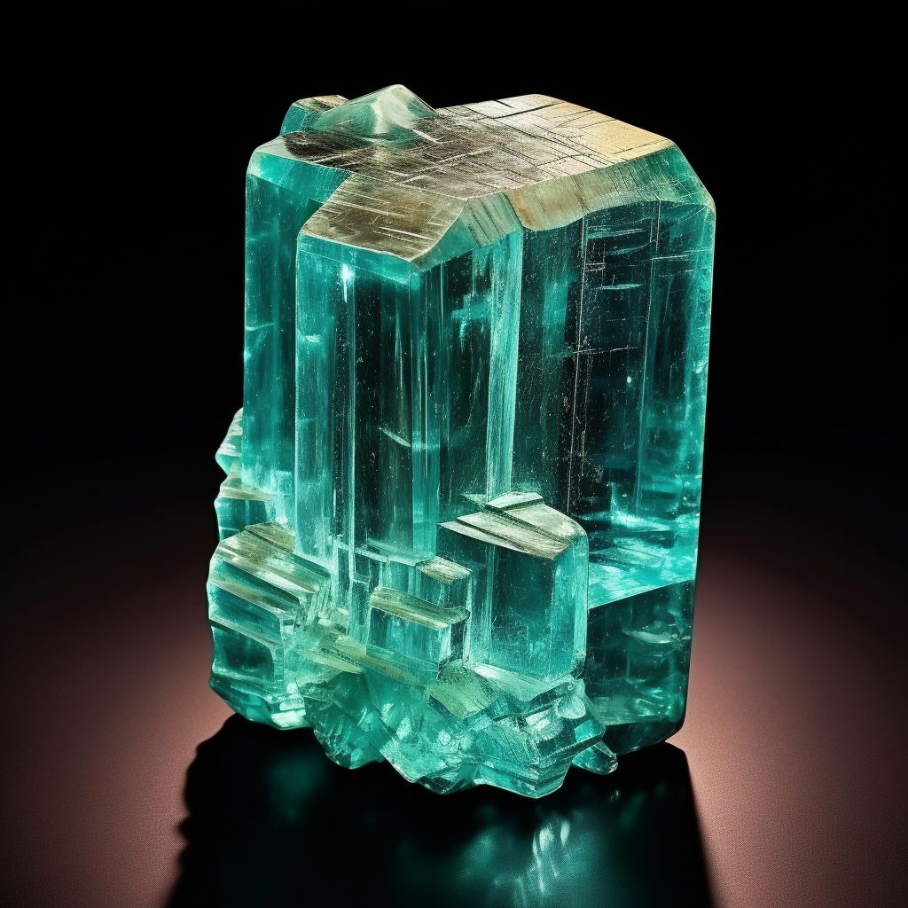

## Table of contents

## Overview

The name aquamarine comes from _aqua_ (Latin for `water`), and _marine_, deriving from _marina_ (Latin for `of the sea`). The first reference in English to "Aquamarina" appears in **Anselmus Boetius De Boot** book _GEMMARUM ET LAPIDUM HISTORIA_ (1609, in Latin). It was later cited in _A Lapidary History or History of Precious Stones_ by **Thomas Nicols**, Cambridge (1652, page 114), where it states that the name was used by the Italians for blue-green varieties of beryl.

More info can be found here 👉[^1]

[^1]: https://www.gemdat.org/gem-289.html

## Formula

Be3Al2Si6O18

## Colour

Pale to medium blue, blue-green

## Hardness

7.5 to 8

## Specific Gravity

2.66 to 2.80

## Images

