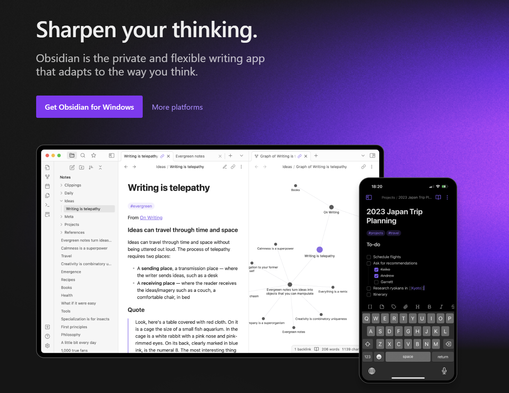

## Table of contents

## Unleashing Creativity with Obsidian

**Obsidian**[^1], a powerful note-taking and knowledge management app, has become a favorite among those seeking a robust tool for organizing ideas and brainstorming. In this article, we'll explore some creative ways to make the most of Obsidian for unleashing your creativity.

## **Interactive Mind Maps**

### Utilize the Graph View

Leverage Obsidian's Graph View to visualize connections between notes, creating an interactive mind map of your ideas. This feature helps you identify relationships and discover new insights within your brainstorming sessions.

### Embed Diagrams with Mermaid🧜‍♀️

Markdown allows you to embed Mermaid diagrams, offering a dynamic and visual representation of your thought processes. Use this to create flowcharts, sequence diagrams, or any other visual aids to enhance your understanding.

## **Dynamic Checklists for Project Management**

### Task Lists with Markdown

Employ Obsidian's support for Markdown to create dynamic checklists. Whether for project planning or daily to-dos, Markdown makes it easy to create, update, and check off tasks as you progress.

### Daily Notes for Progress Tracking

Utilize the power of daily notes to track your progress. Include accomplishments, challenges, and reflections, turning Obsidian into a dynamic journal for your projects.

## **Creative Writing and Storyboarding**

### Storyboarding with Image Embeds

Use Obsidian to storyboard your creative writing projects. Embed images to illustrate scenes, characters, or any visual inspirations directly within your notes.

### Version Control for Iterative Writing

Leverage Obsidian's version control to track changes in your writing. This ensures that you can experiment with different ideas, compare versions, and revert to previous states easily.

## **Research and Citation Management**

### Zettelkasten Method for Research

Implement the Zettelkasten method by creating atomic notes for each idea or piece of information. Connect these notes to build a web of knowledge, aiding in more robust and interconnected brainstorming.

### Bibliography Management with Citations

Use Obsidian to manage your bibliography and citations. With proper linking and organization, it becomes a powerful tool for academic and research-oriented brainstorming.

## **Collaborative Workspaces**

### Shared Folders for Team Collaboration

Organize your notes into shared folders, enabling seamless collaboration with team members. Obsidian's real-time syncing ensures everyone is on the same page, fostering collective brainstorming.

### Inline Comments for Feedback

Leverage inline comments within your notes for feedback and discussions. This feature enhances collaborative brainstorming by providing a platform for dynamic conversations within the app.

## Conclusion

Obsidian, with its flexible Markdown support and dynamic linking, proves to be an invaluable tool for organizing ideas and brainstorming creatively. Whether you're a writer, researcher, project manager, or collaborator, Obsidian empowers you to unlock your creativity and turn your ideas into reality.

[^1]: https://obsidian.md/
