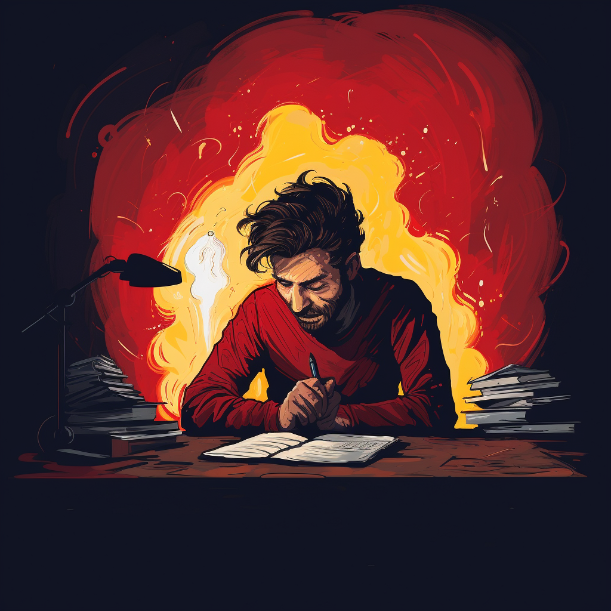
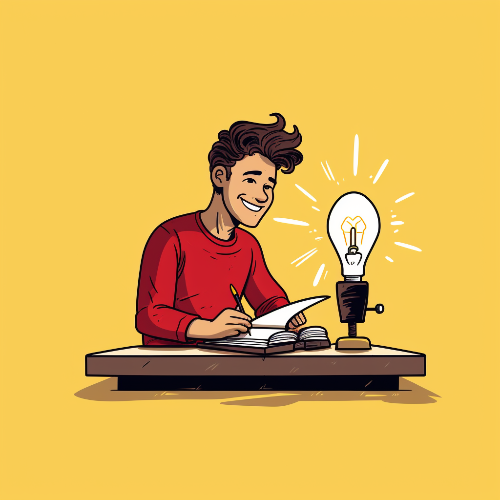

_Entropia_

## Table of contents

# Introducere

Mintea tinde spre dezordine și entropie. Pentru a inversa entropia e nevoie să ajutăm mintea să fie mai organizată, să o ajutăm prin procese să creeze structură și ordine din haos.

Viața noastră e un proiect în continuă modelare. Locul de muncă este un proiect, familia este un alt proiect, afacerea este un proiect, sănătatea de asemenea.

> _"Avem o tendință exacerbată de a prelua sfaturi de viață și carieră de la oameni care nu au realizat ceea ce noi dorim să realizăm."_
>
> - _Dan Koe_[^1]

Începutul este cel mai delicat moment de aceea e bine să nu lăsăm creierul să înceapă să găsească motive de procrastinare.

> Majoritatea oamenilor nu au un proiect personal care le va _făuri_ viitorul dorit.

> Majoritatea oamenilor nu realizează faptul că un proiect personal **_nu_** este opțional pentru a _crea_ viitorul pe care _ei_ și-l doresc.

Singura lor opțiune e să trăiască conform limitelor programării lor, a standardelor și obiectivelor creionate de societate, prin munca asiduă în implementarea acelor obiective.

Dacă nu munciți **o oră** pe zi pentru a vă îndeplini visurile, veți petrece opt ore pe zi muncind pentru visurile altuia, **toată** viața.

Internetul este direcționat de nevoia de acces la conținut. Conținutul (sau media) este fațada internetului. Iar baza conținutului este... _scrisul_ ✍️

**Scrisul** este cel mai important instrument aflat la dispoziția noastră pentru a ne îndeplini visurile. Scrisul este singura aptitudine care insuflă viață în orice altă aptitudine.

# Cum captivezi atenția?

Cum reușim să captivăm atenția publicului în era internetului?

1. Alegem un subiect de care suntem pasionați
2. Practicăm zilnic scrisul
3. Adăugăm perspectiva noastră unică
4. Noutatea captivează atenția. Atenția e necesară dacă vrem să atragem cititorii. Cum facem asta?
   - probleme comune asociate subiectului
   - beneficii ale rezolvării problemelor respective
   - obiective comune asociate subiectului

Arta scrisului este un exercițiu.

Pentru aceasta vă propun următorul sistem de organizare și jurnal scris:

`D.O.M.I.T.`[^2]

# D-`escărcare`

> ”_Scrie despre ceea ce te face nervos, te agită, sau îți creează anxietate!_”
>
> - _Po Bronson_

Nu știu ceea ce gândesc până nu aștern gândurile pe hârtie.

Începe cu ceea ce te mânie, enervează sau deranjează, asta te va ajuta să treci cu bine peste prima etapa.

Acest lucru are beneficii substanțiale asupra stării tale mentale. În loc să păstrezi gândurile negative în minte, le vei scrie pe o foaie de hârtie, astfel limpezind mintea și îmbunătățind starea de bine.

Gândurile sunt haotice înainte să fie notate pe hârtie. După ce le scriem ele devin mai ordonate.

Ceea ce vrem e să luăm toată dezordinea din cap și să o punem pe hârtie.

Când suntem cu gândurile în cap ne aflăm în întuneric. Pe măsură ce le enunțăm în scris începem să ne luminăm.

_Înainte_

_După_

# O`-bligații`

Aici ne eliberăm nu doar de gândurile noastre dar și de responsabilități.
Vrem să păstrăm mintea pentru **rezolvarea** problemelor, nu pentru **memorarea** lor.
Pentru aceasta vrem să enunțăm toate problemele pe hârtie, în jurnal.

Pașii sunt următorii:

1. **Scrierea** listei de obligații (orice ar putea fi considerat câtuși de puțin drept _"obligație"_), de la cel mai banal la cel grandios - cum ar fi:
   - lista de cumpărături
   - memento pentru actualizarea permisului de conducere
   - calendar pentru plata creditelor
   - calendar al zilelor de naștere pentru membrii familiei
   - răspunsul dat unui client
   - formularea unei cereri la Primărie
   - _etc._
2. **Organizarea** acestor obligații în diverse categorii:
   - Familie
   - Finanțe
   - Sănătate
   - Muncă
3. **Prioritizarea** obligațiilor se face punând următoarea întrebare pentru fiecare sarcină:
   > Mă ajută să înaintez?
   > Face barca să meargă mai repede?
   > Care sarcină din această listă ușurează cel mai mult celelalte sarcini? (Aceasta ajută prioritizarea sarcinilor cu adevărat importante)
4. **Minimul** de efort și **Succesul** răsunător ajută să reducem nivelul de auto-învinovățire pentru sarcinile neefectuate.
   - Care este minimul de obligații care mă ajută să fac ziua de mâine mai ușoară?
   - Care sarcini mă ajută să trec la nivelul următor și să îmi aducă succesul?

# M-`entalitate `

Creierul trebuie antrenat ca un mușchi al corpului. Pentru a ne îmbunătăți modul de gândire și perspectiva asupra lumii e nevoie de o introspecție sinceră.

Avem la dispoziție câteva tehnici pentru asta:

1. **Reformularea** gândurilor noastre într-o lumină pozitivă ajută creierul să găsească soluții și răspunsuri pozitive chiar și în situații dificile.
   > Cum este **acesta** cel mai bun lucru care mi s-a întâmplat vreodată?
2. **Posibilitățile** ne învață să ne depășim convingerile care ne limitează. Afirmațiile gen "Sunt sănătos" fără un "pentru că", nu au absolut nici o valoare sau greutate în mintea noastră fără dovezi. Creierul caută dovezi clare. Pe de o parte putem identifica dovezile din start, pe de altă parte le putem crea, deschizând astfel o suită întreagă de posibilități. Este și un instrument pentru a ne face o analiză a realității.
   - Folosim afirmația _"Pentru că..."_
   - ex: "Sunt sănătos _pentru că_ mănânc sănătos, fac zilnic mișcare și am un somn odihnitor."
3. **Inversarea** implică a privi soluția cât și opusul acesteia. Ne ajută să vedem soluția mult mai clar și din perspectiva opusă.
   - Când ești blocat pe o întrebare la care cauți răspuns, întreabă opusul, de ex:
     - Cum pot face mai **mulți** bani?
     - Cum pot face mai **puțini** bani?
4. **Perspectiva** ne ajută să ne detașăm de propria persoană și să vedem lucrurile din alt unghi. Este foarte ușor să dăm sfaturi altora în situații dificile, dar extrem de greu să găsim soluții când este vorba de noi.
   - Dacă aș fi în locul lui _X_, cum aș proceda? Ce aș face?
   - Dacă aș fi un prieten care mi-ar da **mie** un sfat, ce sfat mi-aș oferi pentru a avea succes?
5. **Disciplina** este deprinderea cu o ordina strictă, cu un program predefinit, clar, care ne oferă un orizont de timp predictibil și lipsit de stres.
   - Atunci când mâncăm nu vorbim
   - Când lucrăm la un proiect nu ne apucăm sa ne uităm pe telefon.
6. **Recunoștința** scoate la iveală lucrurile pozitive, banale sau ieșite din comun.
   - Ceva banal precum zâmbetul unui străin la magazin
   - Ceva întâmplător precum apariția unui curcubeu
   - Ceva ce am făcut eu, de ex a deschide ușa pentru o femeie, lansarea unui site personal etc

# I`-dei`

Dacă vrem să rezolvăm o problemă putem face următorul experiment: ne punem un cronometru de cinci minute în care ne gândim la 30 de răspunsuri posibile.

O altă variantă e să privim problema din perspectiva unui expert în domeniu: _Cum ar rezolva Elon Musk problema?_

A treia tehnică e crearea unei bucle. O putem folosi când ne confruntăm cu găsirea unei soluții la o întrebare dificilă

- deschidem bucla scriind întrebarea
- mergem la somn
- dimineața găsim răspunsul și închidem bucla

# T-`raiectorie`

Scrisul ne face să conștientizăm mai bine direcția în care mergem.
Avem două tipuri de traiectorii:

- Termen **lung**
  - Definește clar obiectivul
  - Enumeră dovezile care arată că te apropii de obiectiv
  - Enumeră dovezile care indică îndepărtarea de acesta
- Termen **scurt**, cotidian. Acest tip de traiectorie folosește metrici precum starea de spirit, fericirea, satisfacția, stresul, pacea interioară.
  - Ce mă stoarce de energie?
  - Ce mă face să sar de bucurie?
  - Ce îmi aduce satisfacție?
  - Ce îmi creează pace interioară?
  - Ce am învățat de aici?

[^1]: The Art of Focus https://www.youtube.com/watch?v=_VLZ4b9LHLs
[^2]: D.O.M.I.T. este denumirea tradusă a sistemului `V.O.M.I.T.` prezentat aici 👉 https://www.youtube.com/watch?v=U8RQsJ0Q3Mo
