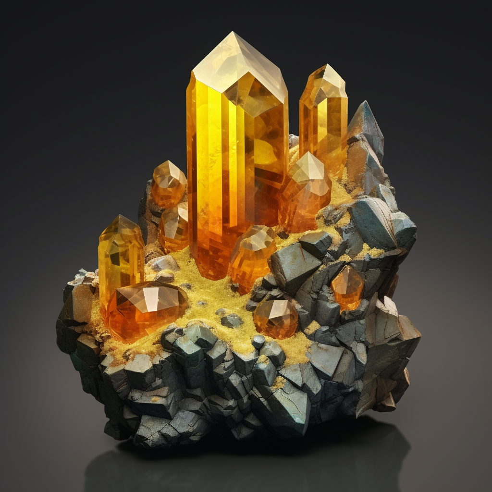

# Learn about the Anglesite gemstone[^1]

Welcome to a fascinating journey into the world of the Anglesite gemstone. In this article, I will provide you with valuable information about this beautiful gemstone, including its properties, meaning, origin, and uses. Whether you are a gemstone enthusiast, a jewelry lover, or simply curious about the wonders of nature, the Anglesite gemstone has much to offer.

### Key Takeaways:

- Anglesite is a captivating gemstone known for its unique properties and meanings.
- It has a range of colors, including white, gray, and yellow.
- The Anglesite gemstone is believed to possess powerful spiritual and metaphysical properties.
- It is primarily mined in countries like Mexico, Morocco, and Australia.
- The Anglesite gemstone can be used in various jewelry pieces and is also associated with healing and energy balancing.

## Properties of the Anglesite Gemstone

When it comes to gemstones, the Anglesite gemstone stands out with its unique properties. From its hardness to its dazzling color variations, this gemstone has much to offer. Let's explore the distinctive traits that make the Anglesite gemstone a prized possession for gem enthusiasts.

### Hardness

One of the defining features of the Anglesite gemstone is its remarkable hardness. With a rating of 3.5 to 4 on the Mohs scale, it falls within the moderate range. This means that the gemstone is relatively durable and can withstand everyday wear, making it suitable for a variety of jewelry pieces.

### Color Variations

The Anglesite gemstone displays an exquisite range of colors, adding to its allure. Its most common color is colorless, but it can also be found in stunning hues of white, yellow, gray, and brown. These captivating variations allow for endless creative possibilities when it comes to designing jewelry or incorporating the gemstone into various decorative items.

### Special Characteristics

What sets the Anglesite gemstone apart are its unique characteristics. One of the standout features is its transparency, which allows light to pass through and creates a captivating luminosity. Additionally, this gemstone has a vitreous to adamantine luster, enhancing its brilliance and adding a touch of elegance to any piece of jewelry.

> "The Anglesite gemstone's hardness, color variations, and special characteristics make it a captivating choice for jewelry enthusiasts." - Gemstone Expert

| Property                | Details                                     |
| ----------------------- | ------------------------------------------- |
| Hardness                | 3.5 to 4 on the Mohs scale                  |
| Color Variations        | Colorless, white, yellow, gray, brown       |
| Special Characteristics | Transparency, vitreous to adamantine luster |

As we delve further into the Anglesite gemstone, we will uncover its intriguing meanings and symbolism. Stay tuned to discover the deeper significance that this gem holds.

## Meaning and Symbolism of the Anglesite Gemstone

When it comes to the Anglesite gemstone, its beauty goes beyond its external appearance. This captivating gem holds deep meanings and symbolism that have intrigued gemstone enthusiasts for centuries.

_Connected with spiritual and metaphysical properties, the Anglesite gemstone possesses a unique energy that can resonate with individuals on a personal level._

One of the key meanings associated with the Anglesite gemstone is its ability to enhance intuition and spiritual awareness. This gem is believed to open up channels of communication with higher realms, allowing individuals to tap into their inner wisdom and intuition with greater clarity.

Additionally, the Anglesite gemstone is often associated with spiritual healing and transformation. Its calming and soothing energies are said to cleanse the mind, body, and spirit, promoting a sense of peace and balance in one's life.

_"The Anglesite gemstone serves as a powerful tool for spiritual growth and self-reflection," says gemstone expert Jennifer Smith. "It encourages individuals to dive deep into their inner selves, uncovering hidden truths and embracing their authentic selves."_

To further understand the meaning and symbolism of the Anglesite gemstone, let's explore the various ways it is believed to impact different aspects of life:

### Emotional Healing and Stability

The Anglesite gemstone is said to have a calming effect on emotions, helping individuals find inner peace during challenging times. It is believed to alleviate stress, anxiety, and emotional imbalances, allowing for a greater sense of stability and emotional well-being.

### Spiritual Awakening and Transformation

As a gemstone known for its connection to higher realms, the Anglesite gemstone is said to assist in spiritual awakening and transformation. It can facilitate spiritual growth, increase awareness of one's spiritual path, and provide guidance on this journey.

### Communication and Expression

Wearing or working with the Anglesite gemstone is believed to enhance communication skills and self-expression. It can help individuals express their thoughts, feelings, and ideas with clarity and confidence, promoting effective communication and fostering harmonious relationships.

### Intuition and Psychic Abilities

The Anglesite gemstone is highly regarded for its ability to stimulate and amplify intuition and psychic abilities. It can help individuals tap into their intuitive gifts, making it easier to trust their inner guidance and receive insights from higher realms.

Overall, the meaning and symbolism of the Anglesite gemstone invite individuals on a transformative journey of self-discovery, spiritual awakening, and emotional healing. Its energies resonate deeply, offering a profound connection to higher realms and a pathway to personal growth.

| Meaning and Symbolism                            | Properties                                                                  | Benefits                                  |
| ------------------------------------------------ | --------------------------------------------------------------------------- | ----------------------------------------- |
| Enhancement of intuition and spiritual awareness | Highly translucent and vitreous luster                                      | Emotional healing and stability           |
| Spiritual healing and transformation             | Hardness of 2.5-3 on the Mohs scale                                         | Spiritual awakening and transformation    |
| Calming and soothing energies                    | Colors range from colorless to shades of white, yellow, and gray            | Enhanced communication and expression     |
| Alignment with higher realms                     | Metaphysical properties include intuition enhancement and psychic abilities | Increased intuition and psychic abilities |

## Origins and Mining of Anglesite Gemstone

When it comes to the Anglesite gemstone, understanding its origins and mining processes can provide valuable insights into this precious gem. Let's take a closer look at the geographical origins of Anglesite and how it is mined.

Anglesite gemstones can be found in several countries around the world, but they are most commonly mined in:

- Morocco
- Australia
- China
- Germany
- United States

These countries are known for their rich deposits of Anglesite, making them significant sources for this gemstone. The specific locations within these countries where Anglesite can be found vary, but they all share the common characteristic of producing high-quality gemstones.

The mining process for Anglesite involves several intricate steps to extract the gemstone from its natural environment. While the exact methods may vary depending on the location and mining regulations, the general process typically includes the following:

1. Exploration and excavation of potential mining sites
2. Sample collection and analysis to determine gemstone presence
3. Drilling and blasting to remove overburden and access the gemstone-bearing rock
4. Extraction of the rock containing Anglesite through mining techniques such as underground mining or open-pit mining
5. Crushing and grinding the extracted rock into smaller fragments
6. Separating the Anglesite gemstone from other minerals through various techniques such as flotation or gravity separation
7. Cleaning and preparing the recovered Anglesite gemstones for market

Through these meticulous mining processes, Anglesite gemstones are carefully extracted and refined to reach the hands of gemstone enthusiasts around the world.

> The beauty of Anglesite gemstones lies not only in their exquisite appearance but also in the journey they undergo from their origins deep within the earth to becoming captivating pieces of jewelry or cherished gemstone specimens.

| Country       | Main Anglesite Mining Locations       |
| ------------- | ------------------------------------- |
| Morocco       | Touissit, Mibladen, Bou Bekker, Aouli |
| Australia     | Lindsay, Cromwell, Broken Hill        |
| China         | Guangdong Province, Guangxi Province  |
| Germany       | Baden-Württemberg, Saxony             |
| United States | New Jersey, Arizona, Montana          |

## Uses and Benefits of the Anglesite Gemstone

The Anglesite gemstone offers a wide range of practical uses and benefits that make it a popular choice among individuals seeking both aesthetic appeal and holistic well-being. From stunning jewelry pieces to its potential healing properties, Anglesite gemstone has something unique to offer to those who incorporate it into their lives.

### 1. Jewelry Making

One of the primary uses of the Anglesite gemstone is in jewelry making. Its beautiful, translucent appearance, with variations of colors ranging from colorless to pale blue to green, makes it an excellent gemstone for creating eye-catching and elegant jewelry pieces. Anglesite gemstone can be faceted or polished into various shapes, including cabochons, beads, and pendants, to suit individual preferences and design aesthetics.

### 2. Healing Properties

Anglesite gemstone is believed to possess various healing properties that can positively impact physical, emotional, and spiritual well-being. Here are some of the healing properties associated with this gemstone:

- **Physical Healing:** Anglesite gemstone is said to have a detoxifying effect on the body, helping to remove toxins and promote overall wellness. It is also believed to have a calming effect on the nervous system, aiding in stress relief and promoting restful sleep.
- **Emotional Healing:** The Anglesite gemstone is thought to enhance emotional clarity and communication. It is believed to help individuals express their true thoughts and emotions, promoting openness and harmony in relationships.
- **Spiritual Healing:** Anglesite gemstone is associated with spiritual awakening and enlightenment. It is believed to enhance spiritual communication and connection, facilitating a deeper understanding of oneself and the universe.

### 3. Metaphysical Properties

Anglesite gemstone possesses metaphysical properties that are highly valued by crystal enthusiasts and spiritual practitioners. Some of the metaphysical properties attributed to this gemstone include:

> "The Anglesite gemstone is believed to enhance intuition and psychic abilities. It is said to open and activate the third eye chakra, which is associated with insight, wisdom, and spiritual awareness. This gemstone is also thought to uplift one's spiritual energy and promote a sense of inner peace and positivity."

## Comparison of Anglesite Gemstone Uses and Benefits

| Uses                    | Benefits                                                                                                           |
| ----------------------- | ------------------------------------------------------------------------------------------------------------------ |
| Jewelry Making          | Enhances personal style                                                                                            |
| Physical Healing        | Detoxifies the body  Calms the nervous system                                                                   |
| Emotional Healing       | Promotes emotional clarity and communication                                                                       |
| Spiritual Healing       | Aids in spiritual awakening and connection                                                                         |
| Metaphysical Properties | Enhances intuition and psychic abilities  Opens and activates the third eye chakra  Uplifts spiritual energy |

## Conclusion

In conclusion, the Anglesite gemstone is a truly remarkable gem that captures both beauty and spiritual significance. Its unique blend of properties, meanings, and origins make it a valuable addition to anyone's collection.

With its aesthetic appeal, Anglesite can be crafted into stunning jewelry pieces that will be cherished for years to come. Its delicate hues and subtle color variations make it a versatile gemstone that can complement different outfits and styles.

Moreover, the Anglesite gemstone holds deep symbolism and metaphysical properties. It is believed to enhance spiritual growth, promote inner peace, and strengthen intuition. By connecting with the energies of this gem, one can experience a heightened sense of well-being and clarity.

Whether you appreciate the Anglesite gemstone for its visual allure or its spiritual significance, it has the power to enrich your life in numerous ways. By understanding its properties, meanings, and origins, you can cultivate a deeper appreciation for this captivating gemstone and harness its potential to enhance your overall well-being.

## FAQ

### What are the properties of the Anglesite gemstone?

The Anglesite gemstone is known for its high transparency and vitreous luster. It has a Mohs hardness of 2.5 to 3 and can appear in various colors such as colorless, white, gray, yellow, and green. It is also characterized by its orthorhombic crystal structure.

### What is the meaning and symbolism of the Anglesite gemstone?

The Anglesite gemstone is believed to have calming and soothing energies. It is associated with serenity, patience, and inner peace. It is also said to enhance spiritual communication and intuition, making it a popular choice for meditation and spiritual practices.

### Where does the Anglesite gemstone originate from?

The Anglesite gemstone is primarily found in countries such as Mexico, Morocco, Australia, and Greece. These regions are known for their rich mineral deposits and are the primary sources of Anglesite gemstones.

### What are the uses and benefits of the Anglesite gemstone?

The Anglesite gemstone is often used in jewelry-making, particularly in the creation of elegant necklaces, earrings, and rings. It is also believed to have healing properties, such as aiding in throat-related issues, promoting clarity of thought, and assisting in spiritual growth and self-expression.

[^1]: Article generated with AI
