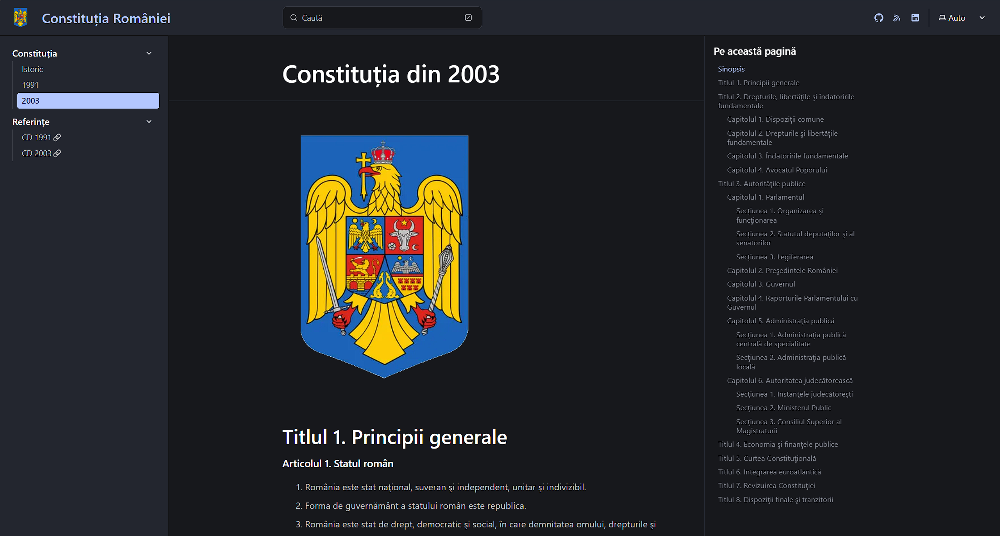

# Lansare website Constituție

Azi am lansat noul website pentru [Constituția României](https://constitutia.florin.page).

Momentan este lansat pe un subdomeniu până când voi găsi ceva permanent.

Pagina se află încă în construcție, urmând să fie adăugate mai multe informații și documente despre `Constituție`. Ea este dedicată celor care sunt sătui de modul antic de prezentare al informațiilor de tip legal.

Sper că prin această inițiativă să putem revigora modul de lucru al firmelor românești în colaborarea cu statul, cât și abordarea estetică a acestora.

Cu acest prilej vă invit să intrați în discuție și să veniți cu idei și propuneri pe [GitHub](https://github.com/twentytwokhz/constitutie)

## Nihil Sine Deo!☦️
