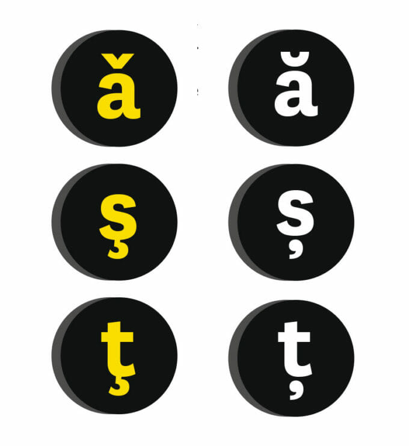

# Sinopsis

De ceva vreme mă gândesc la o variantă simplă, rapidă și gratuită (dacă se poate) pentru a putea elimina diacriticele dintr-un text, respectiv pentru a le genera automat în cazul lipsei lor.

# De ce?

Problema mea este că, în general, când scriu articole pe blog, sau documente în orice editor de text, prefer să le redactez fără nevoia de a apela la caracterele specifice limbii române. Ele sunt amplasate, de obicei, într-un layout specific și uneori e mai dificil să le folosești când vrei să așterni rapid pe "foaie" ideile.

De aceea consider oportună apariția unui instrument care să facă această operație automat.
În momentul de față sunt în faza de cercetare, dar rezultatele arată promițător.

# Resurse

Un articol extraordinar de interesant, bine documentat și pertinent despre diacritice poate fi consultat [aici](https://www.dor.ro/diacritice/)

`În DESPRE SCRIEREA LIMBEI RUMĂNE (1866), Titu Maiorescu propune sedila ca singură soluţie potrivită pentru marcarea sunetelor ş şi ţ. În tipografie, semnul a fost ilustrat cu o virgulă.`

## Va urma...
